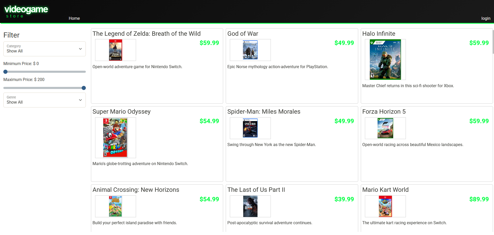
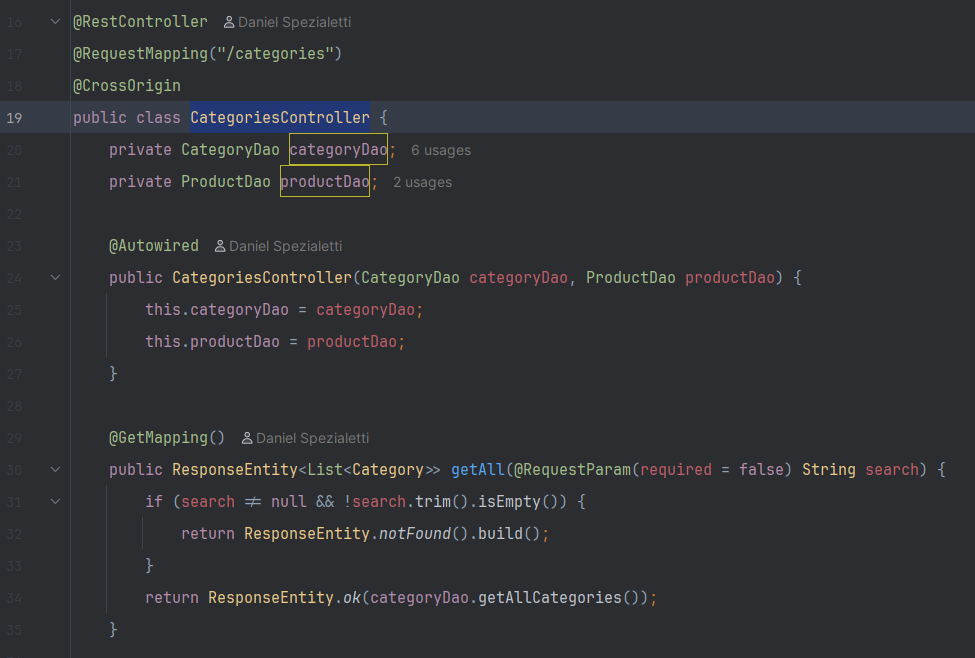
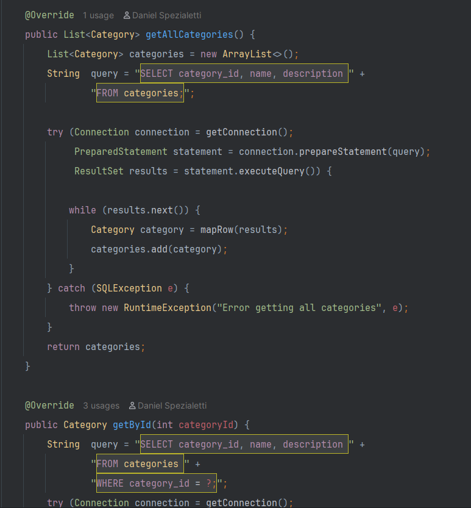
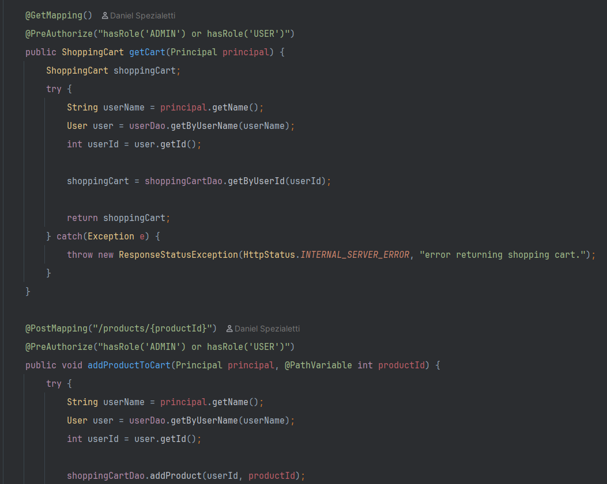

# Capstone3

### Project Overview
This program mainly utilizes the Spring Framework and Java to display a custom Video Game Store website. Users can view the website and perform the following actions:

* View various products on the home page
* Refine their search by product category or price using a slider

If the user has an account, they can also:

* Add products to their cart,
* View their cart
* Remove products from their cart

It should be noted that the front-end of this project, the database, and most of the structure of this program were pre-existing. This capstone is intended to highlight my knowledge on the Spring Framework and developing Spring Boot applications.
Some data within the database was modified by me to create a more personalized experience.

Below are some screenshots of the front-end website and the program running in IntelliJ for a visual reference.

### Program Screenshots

#### Front End HomeScreen

#### Front End Cart

#### Categories Controller

#### Categories Dao

#### Shopping Cart Controller

#### Shopping Cart Dao

